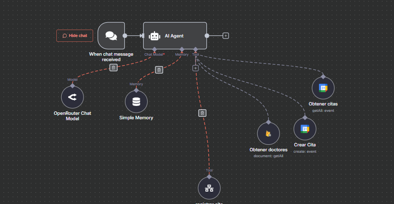
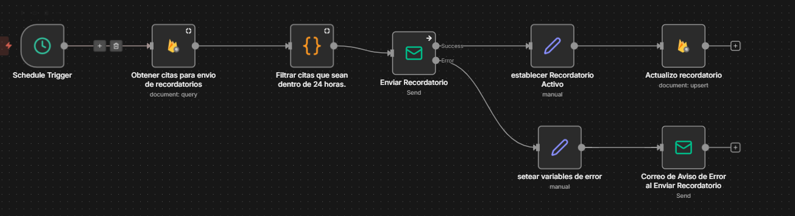

# automation-portafolio
# 🏥 Asistente de Gestión de Citas Médicas con IA  
Agente diseñado para gestionar citas médicas utilizando Google Calendar y Firestore, con reglas empresariales estrictas, validación de horarios, uso de fechas reales y flujo conversacional seguro.

Este proyecto fue creado como demostración de capacidades en diseño de agentes y flujos conversacionales.

  
> Nota: Si deseas, puedo mostrarte el workflow funcionando en vivo o enseñarte cómo está integrado paso a paso.

---

## 🚀 Características principales

### ✔️ Integración con:
- **Google Calendar** (creación de eventos)  
- **Firestore** (registro de citas)  
    - Nodo separado que es llamado por las tools.  
- **API de Doctores**  
- **API de Citas por fecha/hora**  

### ✔️ Flujos automatizados
#### 📅 Creación de citas
- Flujo que permite registrar nuevas citas médicas desde el agente.  
- Incluye validación de horarios, disponibilidad del doctor y confirmación antes de crear la cita.  

#### ⏰ Recordatorio de citas
- Flujo programado que filtra citas del día siguiente y envía recordatorios por email.  
- Maneja errores de envío, registra fallos y actualiza el estado del recordatorio en Firestore.  

### ✔️ Funciones de calendario
- Obtiene la fecha y hora actual con `{{ $now }}`  
- Comprueba si la fecha y hora solicitadas ya pasaron  
- Valida disponibilidad del doctor antes de crear la cita  
- Sugiere horarios alternativos si el solicitado no está disponible  

### ✔️ Flujo conversacional
1. Motivo y nombre del paciente  
2. Selección de doctor  
3. Validación de fecha y hora  
4. Confirmación final  
5. Creación de cita en Calendar  
6. Registro en Firestore  

Con reglas para evitar errores, duplicados y violaciones de privacidad.

---

## 🧠 Prompt del agente

El agente se rige por un **sistema de reglas estrictas**, incluyendo:

- Confidencialidad absoluta  
- No revelar eventos existentes  
- No inventar doctores, horarios ni datos  
- Validar todo con herramientas externas  
- No crear una cita sin confirmación explícita  
- Una sola cita por conversación  
